# Guía Completa: Módulo de Guiones y Guion en Vivo

> **Defensa Universitaria** — Sistema "Itinerario" para la gestión de eventos en estadio de béisbol
> Esta guía explica el **porqué** de cada decisión, la **estructura** de cada capa, y el **flujo completo** de datos desde la UI hasta la base de datos.

---

## Índice

1. [Arquitectura General del Sistema](#1-arquitectura-general-del-sistema)
2. [El Problema que Resuelve](#2-el-problema-que-resuelve)
3. [Base de Datos — Modelo Entidad-Relación](#3-base-de-datos--modelo-entidad-relación)
4. [Patrón MVC — Por qué se usa](#4-patrón-mvc--por-qué-se-usa)
5. [El Módulo de Guiones (CRUD)](#5-el-módulo-de-guiones-crud)
6. [El Módulo En Vivo (Tiempo Real)](#6-el-módulo-en-vivo-tiempo-real)
7. [Flujo Completo de Datos](#7-flujo-completo-de-datos)
8. [Sistema de Seguridad](#8-sistema-de-seguridad)
9. [Bitácora de Auditoría](#9-bitácora-de-auditoría)
10. [Decisiones de Diseño Clave](#10-decisiones-de-diseño-clave)
11. [Cómo Responder en la Defensa](#11-cómo-responder-en-la-defensa)

---

## 1. Arquitectura General del Sistema

### Qué es el sistema

**Itinerario** es una aplicación web para la **gestión integral de eventos** en un estadio de béisbol. Administra:
- **Guiones** — Planes de juego con eventos pre-game y durante el game
- **En Vivo** — Sincronización en tiempo real durante el evento
- Y otros módulos: inventario, mantenimiento, contratos, patrocinadores, premios, etc.

### Stack tecnológico

```
Frontend:  Bootstrap 5.3 + Plus Jakarta Sans + Font Awesome 6 + SweetAlert2
Backend:   Python 3 + Flask 3.1
DB:        MySQL (PyMySQL) — 2 bases de datos
Tiempo real: Flask-SocketIO (WebSocket)
Seguridad: Flask-Login + Flask-WTF (CSRF) + Sistema de permisos por rol
PDFs:      ReportLab
```

### Por qué este stack

| Decisión | Por qué |
|----------|---------|
| **Flask** sobre Django | Flask es más ligero, flexible, y permite arquitectura personalizada. Django tiene "opiniones" fuertes que encajan menos con un sistema que hereda lógica de PHP. |
| **PyMySQL** sobre SQLAlchemy | El sistema original era PHP con MySQL nativo. PyMySQL mantiene el mismo estilo de queries SQL directas, facilitando la migración. |
| **2 bases de datos** | `estadio_db` (datos de negocio) y `seguridad` (usuarios, roles, bitácora). Separación por responsabilidad: los datos de seguridad no se mezclan con los operativos. |
| **SocketIO** | Permite que múltiples pantallas en el estadio se actualicen simultáneamente cuando un operador marca un evento como completado. |

### Estructura de directorios

```
app/
├── __init__.py          ← Factory de Flask + configuración de SocketIO
├── config.py            ← Configuración de las 2 bases de datos
├── database.py          ← Conexión a MySQL con contexto de transacciones
├── controller/          ← Blueprints (rutas HTTP)
│   ├── guion_controller.py
│   ├── en_vivo_controller.py
│   └── ...
├── model/               ← Lógica de acceso a datos
│   ├── guion_model.py
│   ├── en_vivo_model.py
│   ├── interfaces.py    ← Interfaz abstracta CRUD
│   ├── validaciones_model.py ← Mixin de validación reutilizable
│   └── ...
├── helpers/
│   ├── decorators.py    ← Decorador verificar_acceso()
│   └── permission_map.py ← Mapa centralizado de permisos
├── view/                ← Templates Jinja2
│   ├── guion/
│   └── en_vivo/
└── static/js/           ← JavaScript vanilla
    ├── GestionGuion.js
    ├── GestionEnVivo.js
    └── validacion.js
```

**Por qué esta estructura:**
- **Separación por capas**: El controller nunca toca SQL directamente, el model nunca renderiza HTML.
- **Blueprints**: Cada módulo es un Blueprint independiente que se registra en `__init__.py`. Esto permite activar/desactivar módulos sin afectar otros.
- **Cada módulo es autocontenido**: `guion_controller.py`, `guion_model.py`, y `guion/*.html` forman una unidad completa.

---

## 2. El Problema que Resuelve

### Antes del sistema

En un estadio de béisbol, un partido tiene un **itinerario** (guion) que define:
- **Pre-Game**: Eventos antes del juego (música, animaciones, saludos, warming-up) — identificados por **hora**
- **Game**: Eventos durante el juego (cada medio-inning tiene contenido programado) — identificados por **inning + medio** (alta/baja)

**Problemas sin sistema:**
1. El itinerario se manejaba en papel o Excel — no se podía compartir en tiempo real
2. Si se cambiaba algo durante el partido, el resto del equipo no se enteraba
3. No había registro de qué pasó realmente vs qué estaba planeado
4. No se podía reutilizar un itinerario para otra fecha

### Solución del sistema

1. **Módulo Guiones**: Crear, editar, duplicar (replicar) planes de juego
2. **Módulo En Vivo**: Ejecutar el plan en tiempo real, sincronizando a todos los dispositivos conectados
3. **Bitácora**: Registrar todo lo que happened para auditoría

---

## 3. Base de Datos — Modelo Entidad-Relación

### Tablas del módulo de Guiones

```sql
-- Tabla principal: un guión = un plan de juego para una fecha
CREATE TABLE guiones (
  id INT PRIMARY KEY AUTO_INCREMENT,
  nombre VARCHAR(200) NOT NULL,          -- "Cardenales vs Caracas - 2026-06-22"
  estado VARCHAR(20) DEFAULT 'borrador', -- borrador → publicado → en_vivo → finalizado
  tiempo_inning INT,                     -- duración en segundos de cada inning
  grupo_id VARCHAR(36),                  -- UUID para agrupar guiones replicados
  status TINYINT DEFAULT 1,              -- soft delete: 1=activo, 0=eliminado
  creado_en DATETIME,
  modificado_en DATETIME
);

-- Fechas asociadas a un guión (un guión puede tener varias fechas)
CREATE TABLE guion_fechas (
  id INT PRIMARY KEY AUTO_INCREMENT,
  guion_id INT,         -- FK → guiones.id
  fecha DATE NOT NULL
);

-- Cada elemento del itinerario
CREATE TABLE elementos_guion (
  id INT PRIMARY KEY AUTO_INCREMENT,
  guion_id INT,              -- FK → guiones.id
  fecha_id INT,              -- FK → guion_fechas.id (nullable)
  tipo VARCHAR(20),          -- 'pregame' o 'game'
  hora TIME,                 -- solo para pregame (HH:MM)
  inning INT,                -- solo para game (1-9)
  medio_inning VARCHAR(10),  -- solo para game ('alta' o 'baja')
  contenido TEXT NOT NULL,   -- descripción del evento
  duracion_estimada INT,     -- en segundos
  encargado VARCHAR(100),    -- persona responsable
  orden INT,                 -- posición dentro del guión
  estado VARCHAR(20),        -- pendiente | en_curso | completado (solo en vivo)
  creado_en DATETIME
);
```

### Por qué esta estructura

**¿Por qué `guiones` y `elementos_guion` separados?**
- Relación **1:N** — Un guión tiene muchos elementos.
- Permite modificar un elemento sin tocar el guión padre.
- Permite contar elementos, calcular duración total, etc., sin cargar todo el guión.

**¿Por qué `guion_fechas` separada?**
- Un guión puede ejecutarse en **múltiples fechas** (ej: "Cardenales vs Caracas" se juega el 22/06 y el 15/07).
- La tabla permite la relación **N:M** entre guiones y fechas.
- El campo `grupo_id` en `guiones` agrupa guiones que fueron replicados del mismo original.

**¿Por qué `estado` como VARCHAR en vez de INT?**
- Más legible en queries y debugging: `'borrador'` vs `1`.
- El estado es una máquina de estados simple con solo 4 valores posibles.
- En un sistema con pocos estados, legibilidad > rendimiento.

**¿Por qué `status` para soft delete?**
- Los guiones eliminados no se borran de la DB — se marcan con `status = 0`.
- Permite recuperación accidental, auditoría, y consistencia de foreign keys.

**¿Por qué `duracion_estimada` en segundos (INT)?**
- Facilita cálculos: `total = sum(duracion_estimada for e in elementos)`.
- Conversión a legible: `m, s = divmod(total_segundos, 60)`.
- Almacenar como `"2:30"` haría cálculos complicados.

### Diagrama ER simplificado

```
guiones (1) ──→ (N) elementos_guion
guiones (1) ──→ (N) guion_fechas
guion_fechas (1) ──→ (N) elementos_guion  [fecha_id nullable]

Una guión puede tener múltiples fechas.
Cada elemento pertenece a un guión y opcionalmente a una fecha.
```

---

## 4. Patrón MVC — Por qué se usa

### Definición en este sistema

```
┌─────────────┐     ┌──────────────────┐     ┌──────────────┐
│   VIEW       │     │   CONTROLLER      │     │   MODEL       │
│ (Templates)  │ ←── │ (Blueprints)     │ ←── │ (PyMySQL)    │
│              │     │                  │     │              │
│ HTML + CSS   │     │ Recibe request   │     │ Queries SQL  │
│ Jinja2       │     │ Valida datos     │     │ Transacciones│
│              │     │ Llama al model   │     │ Validaciones │
│              │     │ Retorna respuesta│     │              │
└─────────────┘     └──────────────────┘     └──────────────┘
```

### Ejemplo concreto: Agregar un elemento a un guión

**1. El usuario** hace submit del formulario en `agregar_elementos.html`:
```html
<form method="POST" id="elementoForm">
    <select name="tipo">...</select>
    <input name="hora">           <!-- solo para pregame -->
    <select name="inning">...</select>  <!-- solo para game -->
    <textarea name="contenido">...</textarea>
    <input name="duracion_estimada">
    <select name="encargado">...</select>
</form>
```

**2. El controller** (`guion_controller.py:75`) recibe el POST:
```python
@bp.route('/agregar-elemento/<int:id>', methods=['GET', 'POST'])
def agregar_elementos(id):
    if request.method == 'POST':
        # 1. Extrae datos del formulario
        tipo = request.form.get('tipo')
        hora_str = request.form.get('hora', '')
        contenido = request.form.get('contenido', '').strip()

        # 2. Valida reglas de negocio
        if tipo == 'pregame' and not hora_str:
            errores.append('Para Pre-Game debes indicar una hora')

        # 3. Verifica conflictos (hora/inning ya ocupados)
        horas_ocupadas, innings_ocupados = elemento_model.obtener_ocupados(id)
        if hora_str in horas_ocupadas:
            errores.append('Esa hora ya esta ocupada')

        # 4. Si no hay errores, delega al model
        elemento_model.set_guion_id(id)
        elemento_model.set_tipo(tipo)
        elemento_model.set_contenido(contenido)
        elemento_model.confirmar_registro()  # ← llama al model

        # 5. Registra en bitácora
        _registrar_bitacora('create', 'Agregar elemento', f'...')

        # 6. Redirige (patrón Post/Redirect/Get)
        return redirect(url_for('guion.agregar_elementos', id=id))
```

**3. El model** (`guion_model.py:317`) ejecuta SQL:
```python
def _registrar(self):
    if not self._validar_datos_elemento():  # ← validación en el model
        return None
    try:
        db = self._get_db()
        with db.cursor() as cur:
            cur.execute(
                """INSERT INTO elementos_guion
                   (guion_id, tipo, hora, contenido, duracion_estimada, encargado, orden)
                   VALUES (%s, %s, %s, %s, %s, %s, %s)""",
                (self.__guion_id, self.__tipo, self.__hora, ...)
            )
        db.commit()
        return self.obtener_por_id(cur.lastrowid)
    except Exception:
        return None
```

### Por qué esta separación

| Capa | Responsabilidad | Por qué |
|------|-----------------|---------|
| **View** | Solo renderizar HTML | No tiene lógica de negocio. Si cambias la DB, la view no cambia. |
| **Controller** | Recibir request, validar, decidir flujo | Centraliza la lógica HTTP. Un solo lugar para CSRF, autenticación, etc. |
| **Model** | Acceso a datos + validación DB | Reutilizable. El mismo model se usa en controller, reportes, API, etc. |

---

## 5. El Módulo de Guiones (CRUD)

### Flujo completo de crear un guión

```
1. Usuario entra a /guiones/ → dashboard.html muestra listado
2. Clic en "Nuevo Guión" → /guiones/crear → crear.html
3. Formulario: nombre + tiempo_inning
4. Submit → POST /guiones/crear
   ├→ Controller valida nombre (≥3 caracteres)
   ├→ Controller agrega fecha de hoy al nombre: "Mi Guión - 2026-06-22"
   ├→ Model crea registro en tabla `guiones`
   ├→ Model crea registro en tabla `guion_fechas` con hoy
   ├→ Controller registra en bitácora
   └→ Redirect a /guiones/agregar-elemento/{id}
5. agregar_elementos.html: formulario para agregar elementos
   ├→ Cada submit: valida → crea elemento → redirect (PRG pattern)
   └→ Cuando termina: redirect a dashboard
```

### Los dos tipos de elemento

**Pre-Game** (eventos antes del partido):
- Se identifican por **hora** (ej: "18:30 - Warning Song")
- Son eventos fijos en el tiempo
- Ejemplos: música de entrada, saludo de bienvenida, warming-up

**Game** (durante el partido):
- Se identifican por **inning + medio** (ej: "3° Alta - Publicidades")
- Cada medio-inning tiene contenido programado
- La duración viene del `tiempo_inning` configurado en el guión padre

**Por qué la distinción:** En un partido de béisbol, los eventos pre-game tienen horarios fijos, mientras que los eventos del game dependen del progreso del juego (no se puede predecir a qué hora será el 5° inning).

### El sistema de replicación

```python
def replicar(self, guion_origen_id, fechas, nombre_base):
    # Copia el guión original y todos sus elementos para cada fecha
    for fecha in fechas:
        nombre_con_fecha = f"{nombre_base} - {fecha}"
        # Crea guión hijo
        cur.execute("INSERT INTO guiones ...")
        # Copia cada elemento
        for elem in elementos:
            cur.execute("INSERT INTO elementos_guion ...")
```

**Por qué:** Un guión tipo "Cardenales vs Caracas" se usa para múltiples fechas. En vez de crearlo N veces, se crea una vez y se replica (duplica) a las fechas necesarias. Los guiones replicados comparten `grupo_id`.

### Validación en capas

```
Capa 1 — JavaScript (GestionGuion.js):
  - validarNombre() → longitud mínima
  - validarTiempoInning() → formato correcto
  - Verificar nombre duplicado via AJAX

Capa 2 — Controller:
  - Verifica campos obligatorios
  - Verifica conflictos de hora/inning
  - Verifica que el guión exista y no esté en vivo

Capa 3 — Model (ValidacionesMixin):
  - validar_obligatorio()
  - validar_longitud()
  - validar_fecha()

Capa 4 — Base de datos:
  - NOT NULL constraints
  - UNIQUE constraints
  - FOREIGN KEY constraints
```

**Por qué 4 capas:** Defensa en profundidad. Si una capa falla (ej: JavaScript deshabilitado), las demás atrapan el error.

### El patrón Post/Redirect-Get (PRG)

```python
# POST → procesa → REDIRECT → GET
if request.method == 'POST':
    # ... procesar ...
    flash('Elemento agregado', 'success')
    return redirect(url_for('guion.agregar_elementos', id=id))
```

**Por qué:** Evita que el usuario haga refresh del navegador y reenvíe el mismo formulario duplicadamente. Es un estándar de diseño web.

---

## 6. El Módulo En Vivo (Tiempo Real)

### El problema que resuelve

Durante un partido real, múltiples personas en el estadio necesitan ver el mismo itinerario actualizado en tiempo real:
- El operador principal marca un evento como "completado"
- Las pantallas del estadio se actualizan automáticamente
- El director ve el progreso en su tablet
- El equipo de sonido ve cuándo viene el siguiente evento

### La máquina de estados de un guión

```
┌──────────┐    publicar    ┌────────────┐   iniciar   ┌──────────┐   finalizar   ┌─────────────┐
│ borrador │ ──────────────→│ publicado  │ ──────────→│ en_vivo  │ ─────────────→│ finalizado  │
└──────────┘                └────────────┘            └──────────┘               └─────────────┘
                                  │                       ↑
                                  │                       │
                                  └───────────────────────┘
                                    (finalizado puede reiniciar)
```

**Por qué esta secuencia:**
1. **borrador**: El guión se está creando. Se pueden agregar/editar elementos libremente.
2. **publicado**: El guión está listo. Ya no se puede editar (integridad del plan). Aparece en En Vivo como "disponible".
3. **en_vivo**: Solo UN guión puede estar en vivo a la vez. Los elementos cambian de estado en tiempo real.
4. **finalizado**: Terminó el evento. Los elementos se resetean a "pendiente".

### La restricción de un solo guión en vivo

```python
def iniciar(self, guion_id):
    # SQL atómico que verifica y actualiza en una sola operación
    cur.execute(
        """UPDATE guiones SET estado = 'en_vivo'
           WHERE id = %s AND estado != 'en_vivo'
           AND NOT EXISTS (
               SELECT 1 FROM guiones WHERE estado = 'en_vivo' AND id != %s
           )""",
        (guion_id, guion_id)
    )
    if cur.rowcount == 0:
        return False  # Ya hay otro en vivo
```

**Por qué:** Dos guiones en vivo simultáneos causarían confusión — los operadores no sabrían cuál están ejecutando. La restricción es a nivel de base de datos (no solo UI) para garantizar consistencia incluso con múltiples usuarios.

### Los estados de un elemento

```
pendiente ──→ en_curso ──→ completado
    ↑              │
    └──────────────┘  (retroceder: completado → en_curso → pendiente)
```

```python
# En el template, cada elemento tiene:
<div class="elemento {{ 'completado' if e.estado == 'completado' 
                          else 'en_curso' if e.estado == 'en_curso' 
                          else '' }}"
     data-id="{{ e.id }}" 
     data-estado="{{ e.estado }}"
     ondblclick="completarYAvanzar(this)">
```

**Por qué solo 3 estados:**
- **pendiente**: No ha comenzado
- **en_curso**: Está happening ahora
- **completado**: Ya pasó

Es simple, intuitivo, y cubre todos los casos de uso reales.

### WebSocket — Sincronización en tiempo real

**Flujo de sincronización:**

```
1. Operador hace doble clic en un elemento
   │
2. JavaScript local cambia el estado del DOM inmediatamente
   │ (optimistic update — no espera al servidor)
   │
3. JavaScript envía POST a /en-vivo/api/sincronizar/{id}
   │ {estados: [{id: 15, estado: 'completado', accion: 'completar'}, ...]}
   │
4. Controller actualiza MySQL
   │ envivo_model.sincronizar_estados(guion_id, estados)
   │
5. Controller emite evento SocketIO
   │ socketio.emit('actualizar_estados', {guion_id, estados})
   │
6. TODOS los clientes conectados reciben el evento
   │ socket.on('actualizar_estados', function(data) { ... })
   │
7. Cada cliente actualiza su DOM local
```

**Por qué optimistic update:**
El usuario no debe percibir latencia. Si el servidor tarda 200ms, la UI se siente lenta. Con optimistic update, el cambio es inmediato. Si falla, se revierte.

```javascript
function completarYAvanzar(el) {
    // 1. Cambio inmediato en DOM (optimistic)
    el.dataset.estado = 'completado';
    
    // 2. Buscar siguiente pendiente y marcar en_curso
    for (const item of document.querySelectorAll('.elemento')) {
        if (item.dataset.estado === 'pendiente') {
            item.dataset.estado = 'en_curso';
            break;
        }
    }
    
    // 3. Actualizar colores visualmente
    actualizarColores();
    
    // 4. Enviar al servidor (async)
    enviarEstados(cambiados);
}

// Si falla, revertir:
.catch(function() {
    elementosCambiados.forEach(function(e) {
        el.dataset.estado = 'en_curso'; // revertir
    });
    actualizarColores();
});
```

### El template `vivo.html` — Diseño optimizado para tablets

```css
/* Grid de 4 columnas: hora | contenido | duración | encargado */
.elemento {
    display: grid;
    grid-template-columns: 160px 1fr 80px 120px;
    padding: 14px 20px;
    min-height: 56px;
}

/* Estado en_curso: borde verde, fondo semitransparente */
.elemento.en_curso {
    background: rgba(16, 185, 129, 0.08);
    border-left: 4px solid #10b981;
    box-shadow: 0 0 24px rgba(16, 185, 129, 0.08);
}

/* Estado completado: opacidad reducida */
.elemento.completado {
    opacity: 0.35;
}

/* Responsive: en móvil ocultar columna duración */
@media (max-width: 768px) {
    .elemento { grid-template-columns: 50px 1fr 36px; }
    .duracion-col { display: none; }
}
```

**Por qué diseño dark mode por defecto:**
En un estadio durante la noche, las pantallas bright causan fatiga visual. El dark mode reduce la luminosidad y es estándar en aplicaciones de control en vivo.

**Por qué doble clic en vez de un botón:**
Evita clics accidentales. En un ambiente de estrés (partido en vivo), los botones pequeños son propensos a errores. El doble clic es una acción deliberada.

### Touch en tablets

```javascript
// Doble tap para tablets (ondblclick no funciona bien en touch)
var lastTapTime = 0;
document.addEventListener('touchstart', function(e) {
    var target = e.target.closest('.elemento');
    var now = Date.now();
    if (lastTapTarget === target && now - lastTapTime < 300) {
        e.preventDefault();
        completarYAvanzar(target);
    }
    lastTapTime = now;
    lastTapTarget = target;
});
```

**Por qué:** `ondblclick` no es confiable en dispositivos touch. El intervalo de 300ms distingue entre tap simple y doble tap.

### Contadores en header

```python
# En vivo.html, el header muestra:
# ✅ 3 listos  |  ⏳ 5 restantes  |  👥 2 viendo

# Los contadores de "listos" y "restantes" se calculan en JS:
function actualizarColores() {
    const done = document.querySelectorAll('.elemento.completado').length;
    const total = document.querySelectorAll('.elemento').length;
    countDone.textContent = done;
    countRest.textContent = total - done;
}

# El contador de "viendo" viene del SocketIO:
socket.on('usuarios_actualizados', function(data) {
    var enVivo = data.usuarios.filter(u => u.en_vivo_id === guionId);
    document.getElementById('vivo-viewer-count').textContent = enVivo.length;
});
```

---

## 7. Flujo Completo de Datos

### Crear un guión (paso a paso con código)

```
USUARIO                  CONTROLLER                  MODEL                    DATABASE
  │                         │                          │                         │
  │  POST /guiones/crear    │                          │                         │
  │ ──────────────────────→ │                          │                         │
  │                         │  request.form.get()      │                         │
  │                         │  valida nombre           │                         │
  │                         │  set_nombre(nombre)      │                         │
  │                         │  set_fecha(hoy)          │                         │
  │                         │  confirmar_registro()    │                         │
  │                         │ ───────────────────────→ │                         │
  │                         │                          │  _validar_datos_guion() │
  │                         │                          │  (ValidacionesMixin)    │
  │                         │                          │                         │
  │                         │                          │  transaction():         │
  │                         │                          │    INSERT guiones       │
  │                         │                          │ ──────────────────────→ │
  │                         │                          │    INSERT guion_fechas  │
  │                         │                          │ ──────────────────────→ │
  │                         │                          │  return id              │
  │                         │  return id               │                         │
  │                         │                          │                         │
  │                         │  _registrar_bitacora()   │                         │
  │                         │ ───────────────────────→ │  INSERT actividad      │
  │                         │                          │ ──────────────────────→ │
  │                         │                          │                         │
  │  redirect /agregar...   │                          │                         │
  │ ←────────────────────── │                          │                         │
```

### Sincronizar en vivo (paso a paso)

```
OPERADOR               JS (vivo.html)          CONTROLLER                DB + SOCKETIO
  │                        │                      │                         │
  │  doble clic            │                      │                         │
  │ ─────────────────────→ │                      │                         │
  │                        │                      │                         │
  │                        │  completarYAvanzar() │                         │
  │                        │  - cambia DOM local  │                         │
  │                        │  - busca siguiente   │                         │
  │                        │  - actualizarColores()│                        │
  │                        │                      │                         │
  │                        │  enviarEstados()     │                         │
  │                        │  POST /api/sincron...│                         │
  │                        │ ───────────────────→ │                         │
  │                        │                      │                         │
  │                        │                      │  sincronizar_estados()   │
  │                        │                      │  UPDATE elementos_guion  │
  │                        │                      │ ──────────────────────→ │
  │                        │                      │                         │
  │                        │                      │  socketio.emit()        │
  │                        │                      │  'actualizar_estados'   │
  │                        │                      │ ──────────────────────→ │ (broadcast)
  │                        │                      │                         │
  │                        │  socket.on()         │                         │
  │                        │  actualiza DOM       │                         │
  │                        │ ←────────────────────────────────────────────── │
  │                        │                      │                         │
  │  otros dispositivos    │                      │                         │
  │  reciben el evento     │                      │                         │
  │ ←─────────────────────────────────────────────────────────────────────── │
```

### El patrón de la función `_fmt12`

```python
def _fmt12(hora, duracion_segundos):
    """Convierte hora TIME de MySQL a formato 12h con rango de duración.
    
    Ejemplo: hora=18:30, duracion=150s → "6:30 PM - 6:33 PM"
    
    Por qué existe: El template necesita mostrar "cuándo empieza" y 
    "cuándo termina" en formato legible para el operador.
    """
    ts = int(hora.total_seconds())
    h = ts // 3600
    m = (ts % 3600) // 60
    ampm = 'AM' if h < 12 else 'PM'
    h12 = h % 12 or 12
    
    # Calcular hora de fin
    total_min = h * 60 + m + (duracion_segundos // 60)
    eh = (total_min // 60) % 24
    em = total_min % 60
    eampm = 'AM' if eh < 12 else 'PM'
    eh12 = eh % 12 or 12
    
    return f"{h12}:{m:02d} {ampm} - {eh12}:{em:02d} {eampm}"
```

**Por qué en el controller y no en el template:**
El template Jinja2 puede hacer operaciones simples, pero la lógica de conversión de horas es compleja. Mantenerla en el controller facilita testing y reutilización. Además, `timedelta` de MySQL necesita conversión a `time` de Python, que es más limpio hacerlo en Python puro.

---

## 8. Sistema de Seguridad

### Autenticación

```python
# app/__init__.py
login_manager = LoginManager()
login_manager.login_view = 'auth.login'

# El usuario se carga de la DB en cada request:
@login_manager.user_loader
def load_user(user_id):
    return UsuarioModel().obtener_por_id(int(user_id))
```

**Por qué Flask-Login:**
- Maneja sesiones automáticamente (cookie firmada)
- Proporciona `current_user` global
- Se integra con Flask-WTF para CSRF

### Autorización — Sistema de permisos

```python
# permission_map.py
GUION = {
    'guion.dashboard': 'guion.view',
    'guion.crear': 'guion.create',
    'guion.agregar_elementos': 'guion.edit',
    'guion.editar_elemento': 'guion.edit',
    'guion.eliminar_elemento': 'guion.edit',
    'guion.editar': 'guion.edit',
    'guion.previsualizar': 'guion.preview',
    'guion.publicar': 'guion.publish',
    'guion.eliminar': 'guion.delete',
    'guion.replicar': 'guion.create',
}

# decorators.py
def verificar_acceso(permiso_map):
    def _before_request():
        if not current_user.is_authenticated:
            return redirect(url_for('auth.login'))
        permiso = permiso_map.get(request.endpoint)
        if permiso and not current_user.tiene_permiso(permiso):
            flash('No tienes permiso', 'danger')
            return redirect(url_for('dashboard.panel'))
    return _before_request

# En el controller:
bp = Blueprint('guion', __name__, url_prefix='/guiones')
bp.before_request(verificar_acceso(GUION))
```

**Por qué un mapa centralizado de permisos:**
- Un solo lugar para ver todos los permisos del módulo
- Fácil de mantener: si agregas una ruta, solo agregas una línea al mapa
- El decorador `verificar_acceso` es reutilizable para todos los módulos

**La cadena de permisos:**
```
Usuario → Rol → Permisos del rol → verificar_acceso() → current_user.tiene_permiso()
```

```python
def tiene_permiso(self, codigo):
    if self.rol == 'Superadmin':
        return True  # Superadmin tiene todos los permisos
    if self.__permisos_cache is None:
        self.__permisos_cache = UsuarioPermisoModel().obtener_permisos_usuario(...)
    return codigo in self.__permisos_cache
```

**Por qué caché de permisos:**
`tiene_permiso()` se llama en cada request. Sin caché, haría una query a la DB en cada llamada. Con caché, hace una sola query por request y reutiliza el resultado.

### CSRF (Cross-Site Request Forgery)

```html
<!-- En cada formulario HTML -->
<input type="hidden" name="csrf_token" value="{{ csrf_token() }}">
```

```python
# En cada POST vía fetch
headers: { 'X-CSRFToken': getCSRF() }
```

**Por qué CSRF:**
Sin CSRF, un sitio malicioso podría enviar un POST a tu aplicación usando las cookies del usuario autenticado. El token CSRF demuestra que el POST viene de tu sitio, no de un tercero.

### Sesión única

```python
@app.before_request
def verificar_sesion_unica():
    if current_user.is_authenticated:
        sid = session.get('bitacora_sesion_id')
        db_sesion = SesionModel().obtener_por_id(sid)
        if not db_sesion or db_sesion.get('fin_sesion'):
            flash('Tu sesión fue cerrada desde otro dispositivo', 'warning')
            logout_user()
            return redirect(url_for('auth.login'))
```

**Por qué:** Si un usuario inicia sesión en otro dispositivo, la sesión anterior se invalida. Previene uso no autorizado.

---

## 9. Bitácora de Auditoría

### Qué registra

Cada acción importante genera un registro:
```python
ActividadModel().registrar({
    'usuario_id': current_user.id,
    'tipo_accion': 'create',    # create | update | delete
    'modulo': 'guion',          # módulo afectado
    'accion': 'Crear guion',    # descripción de la acción
    'detalle': json.dumps({'detalle': 'Guion "X" creado'}),
    'pagina': request.path,
    'ip_address': request.remote_addr,
})
```

### Dónde se registra

En el controller, después de cada operación exitosa:
```python
# Después de crear
_registrar_bitacora('create', 'Crear guion', f'Guion "{nombre}" creado')

# Después de editar
_registrar_bitacora('update', 'Editar guion', f'Guión "{nombre}" actualizado')

# Después de eliminar
_registrar_bitacora('delete', 'Eliminar guion', f'Guión "{nombre}" eliminado')
```

**Por qué:** Trazabilidad completa. En un entorno de producción, necesitas saber quién hizo qué y cuándo.

### La capa `try/except` silenciosa

```python
def _registrar_bitacora(tipo, accion, detalle):
    try:
        ActividadModel().registrar({...})
    except Exception:
        pass  # ← silencioso
```

**Por qué:** La bitácora es importante, pero NO debe bloquear la operación principal. Si la DB de seguridad está caída, no puedes crear guiones. La bitácora falla silenciosamente y la operación principal continúa.

---

## 10. Decisiones de Diseño Clave

### 1. ValidacionesMixin — Mixin reutilizable

```python
class ValidacionesMixin:
    def __init__(self):
        self.errores = []
    
    def validar_obligatorio(self, valor, nombre):
        if not valor or (isinstance(valor, str) and not valor.strip()):
            self.errores.append(f'{nombre} es obligatorio')
            return False
        return True
    
    def validar_longitud(self, texto, min_len, max_len, campo):
        if len(str(texto).strip()) < min_len:
            self.errores.append(f'{campo} debe tener al menos {min_len} caracteres')
            return False
        return True
```

**Por qué Mixin y no herencia:**
- Python no tiene herencia múltiple de clases con estado confiable
- Un Mixin se "mezcla" en la clase sin crear jerarquías rígidas
- `GuionModel(ValidacionesMixin)` y `ElementoGuionModel(ValidacionesMixin)` comparten validaciones sin heredar de un padre común

### 2. Dos formas de registrar: `confirmar_registro()` y `registrar(dict)`

```python
class GuionModel(ValidacionesMixin):
    def set_nombre(self, valor):
        self.__nombre = valor
    
    def confirmar_registro(self):
        return self._registrar()
    
    def _registrar(self):
        # Usa las propiedades privadas seteadas con set_*
        ...
    
    def registrar(self, datos):
        # Acepta un diccionario directamente
        ...
```

**Por qué dos formas:**
- `set_*` + `confirmar_registro()`: Patrón heredado de PHP original. Más verboso pero explícito.
- `registrar(dict)`: Más Pythonico, acepta un diccionario directamente.
- Se mantiene ambas por compatibilidad con el código existente.

### 3. El helper `_parsear_duracion`

```python
def _parsear_duracion(val):
    """Convierte '2,30' a 150 segundos.
    
    Por qué existe: Los usuarios escriben duración como '2,30' (2 minutos 30 segundos).
    El modelo almacena todo en segundos para facilitar cálculos.
    """
    if ',' in val:
        partes = val.split(',')
        minutos = int(partes[0]) if partes[0] else 0
        segundos = int(partes[1].ljust(2, '0')[:2])
    else:
        minutos = int(val)
        segundos = 0
    return minutos * 60 + segundos
```

**Por qué en el controller y no en el template:**
La conversión es lógica de negocio, no de presentación. El template solo necesita mostrar "2m 30s", el controller necesita el valor en segundos para almacenarlo.

### 4. Obtener horarios ocupados

```python
def obtener_ocupados(self, guion_id):
    """Retorna qué horas y innings ya tienen un elemento."""
    elementos = self.consultar(guion_id=guion_id)
    horas_usadas = set()
    innings_usados = {}
    for e in elementos:
        if e['tipo'] == 'pregame' and e['hora']:
            horas_usadas.add(str(e['hora'])[:5])  # "18:30"
        elif e['tipo'] == 'game' and e['inning']:
            key = f"{e['inning']}-{e['medio_inning']}"  # "3-alta"
            innings_usados[key] = e['id']
    return horas_usadas, innings_usados
```

**Por qué verificar conflictos:**
- Un solo guión no puede tener dos elementos pregame a la misma hora
- Un solo guión no puede tener dos elementos game en el mismo inning+medio
- Esta validación ocurre tanto en el controller (backend) como en el JS (frontend)

### 5. El calendario personalizado

```javascript
// initCalendar() en GestionGuion.js
// Calendario hecho desde cero en vez de usar una librería

function renderCalendar() {
    // Calcula días del mes, marca seleccionados, renderiza en HTML
    const firstDay = new Date(currentYear, currentMonth, 1).getDay();
    const daysInMonth = new new Date(currentYear, currentMonth + 1, 0).getDate();
    // ...
}
```

**Por qué no usar una librería como Flatpickr:**
- Solo necesitamos selección de fechas múltiples, no timepickers ni date ranges
- Un calendario custom tiene ~150 líneas vs引进r una dependencia de ~50KB
- Control total sobre el diseño y comportamiento
- Cumple el principio YAGNI (You Aren't Gonna Need It)

### 6. SocketIO con `csrf.exempt`

```python
csrf.exempt(en_vivo_bp)  # Eximir todo el blueprint de CSRF
app.register_blueprint(en_vivo_bp)
```

**Por qué:** Las llamadas SocketIO no pueden llevar CSRF tokens de la misma forma que los formularios HTML. La autenticación se maneja por la sesión de SocketIO, no por CSRF. **Nota:** Esto es un punto conocido de mejora — se debería CSRF-exempt solo las rutas de SocketIO, no todo el blueprint.

---

## 11. Cómo Responder en la Defensa

### Preguntas típicas y respuestas

**¿Por qué Flask y no Django?**
> Flask nos da flexibilidad para estructurar el sistema como necesitábamos. Viene de un sistema PHP existente, y Flask permite replicar esa arquitectura más naturalmente que Django con sus "batteries included".

**¿Cómo funciona la sincronización en tiempo real?**
> Usamos Flask-SocketIO, que implementa WebSocket con fallback a long-polling. Cuando un operador marca un elemento como completado, el cambio se envía al servidor, se persiste en MySQL, y se emite a todos los clientes conectados vía SocketIO. Los clientes reciben el evento y actualizan su DOM sin recargar la página.

**¿Por qué dos bases de datos?**
> Separamos `estadio_db` (datos de negocio: guiones, inventario, contratos) de `seguridad` (usuarios, roles, bitácora). Esto permite que la DB de seguridad tenga políticas de backup y acceso más restrictivas, y que los datos de negocio no contaminen los logs de auditoría.

**¿Cómo manejas la concurrencia (dos personas intentando iniciar el guión)?**
> La restricción de un solo guión en vivo se valida a nivel SQL con un `UPDATE ... WHERE NOT EXISTS`. Es atómico — si dos usuarios intentan al mismo tiempo, solo uno tiene éxito. El otro recibe un mensaje de error.

**¿Por qué el patrón MVC?**
> Separación de responsabilidades. El controller maneja HTTP, el model maneja la DB, y la view solo renderiza. Esto permite cambiar cualquiera de las tres sin afectar las otras. Por ejemplo, pudimos cambiar de MySQL a otra DB solo modificando los models.

**¿Cómo validas los datos?**
> Cuatro capas: JavaScript en el navegador para feedback inmediato, el controller para reglas de negocio, el model con `ValidacionesMixin` para validaciones de formato, y la DB con constraints NOT NULL y UNIQUE como última línea de defensa.

**¿Qué es la bitácora y por qué?**
> Es un registro de auditoría que captura quién hizo qué, cuándo, y desde dónde. Cada operación CRUD genera un registro. Esto es esencial en sistemas empresariales para trazabilidad y cumplimiento normativo.

**¿Cómo manejas los errores?**
> Todos los métodos de acceso a datos están envueltos en `try/except` que retornan valores por defecto (`[]`, `None`, `False`). Esto evita que un error de DB crashee la aplicación. La bitácora falla silenciosamente para no bloquear la operación principal.

**¿Por qué SocketIO y no polling cada X segundos?**
> El polling crea carga innecesaria en el servidor (requests constantes aunque no haya cambios). WebSocket mantiene una conexión abierta y solo envía datos cuando hay cambios. Es más eficiente y la actualización es instantánea.

**¿Cómo escalas esto?**
> Por ahora, con un solo servidor. Para escalar, se puede usar Redis como message broker para SocketIO (múltiples servidores), y connection pooling para MySQL. El diseño actual es horizontalmente escalable porque el estado está en la DB, no en memoria del servidor.

### Conceptos clave para mencionar

1. **Machine de estados** para guiones y elementos
2. **Optimistic update** en el frontend para UX responsiva
3. **Transacciones atómicas** para iniciar guiones
4. **WebSocket** para sincronización en tiempo real
5. **Defensa en profundidad** para validación (4 capas)
6. **Soft delete** para integridad de datos
7. **PRG pattern** para evitar form resubmission
8. **Mixin pattern** para reutilizar validaciones
9. **Blueprint pattern** para modularidad
10. **Separación de bases de datos** por responsabilidad

---

## Apéndice: Código Clave para Memoria

### El SQL atómico de iniciar guión
```sql
UPDATE guiones SET estado = 'en_vivo'
WHERE id = %s AND estado != 'en_vivo'
AND NOT EXISTS (
    SELECT 1 FROM guiones WHERE estado = 'en_vivo' AND id != %s
)
```

### El emit de SocketIO
```python
socketio.emit('actualizar_estados', {
    'guion_id': guion_id,
    'estados': [{'id': i['id'], 'estado': i['estado']} for i in estados]
})
```

### La función de completar y avanzar (JS)
```javascript
function completarYAvanzar(el) {
    el.dataset.estado = 'completado';
    for (const item of document.querySelectorAll('.elemento')) {
        if (item.dataset.estado === 'pendiente') {
            item.dataset.estado = 'en_curso';
            break;
        }
    }
    actualizarColores();
    enviarEstados(cambiados);
}
```

### La conexión de base de datos
```python
class Database:
    @staticmethod
    def get_connection(db_name='estadio_db'):
        if db_name not in g._db_connections:
            g._db_connections[db_name] = pymysql.connect(**cfg)
        return g._db_connections[db_name]
```

### El decorador de permisos
```python
def verificar_acceso(permiso_map):
    def _before_request():
        permiso = permiso_map.get(request.endpoint)
        if permiso and not current_user.tiene_permiso(permiso):
            return jsonify({'error': 'Sin permiso'}), 403
    return _before_request
```

---

## 12. Diagramas UML — Guía Visual para la Defensa

> Todos los diagramas están en formato **PlantUML**. Puedes copiarlos en [plantuml.com](https://www.plantuml.com/plantuml/uml/) para generar imágenes.

### 12.1 Diagrama de Clases (UML Class Diagram)

```plantuml
@startuml
skinparam classAttributeIconSize 0
skinparam classFontSize 12
skinparam defaultFontSize 11

title Diagrama de Clases — Módulos Guion y En Vivo

package "Model Layer" #LightBlue {
    class ValidacionesMixin {
        +errores: list
        +validar_obligatorio(valor, nombre): bool
        +validar_longitud(texto, min, max, campo): bool
        +validar_fecha(fecha, campo): bool
        +limpiar_errores(): void
        +tiene_errores(): bool
    }

    class GuionModel {
        -__nombre: str
        -__tiempo_inning: int
        -__fecha: date
        -_validar_datos_guion(): bool
        +set_nombre(valor): void
        +set_tiempo_inning(valor): void
        +set_fecha(valor): void
        +confirmar_registro(): int
        +registrar(datos): int
        +consultar(**filtros): list
        +obtener_por_id(id): dict
        +modificar(id, datos): dict
        +eliminar(id): bool
        +replicar(origen_id, fechas, nombre): list
        +verificar_nombre(nombre): bool
        +obtener_fechas(guion_id): list
    }

    class ElementoGuionModel {
        -__guion_id: int
        -__tipo: str
        -__contenido: str
        -__duracion_estimada: int
        -__hora: time
        -__inning: int
        -__medio_inning: str
        -__encargado: str
        -__orden: int
        -_validar_datos_elemento(): bool
        +set_tipo(valor): void
        +set_contenido(valor): void
        +confirmar_registro(): dict
        +consultar(**filtros): list
        +obtener_ocupados(guion_id): tuple
        +obtener_por_guion_ordenados(id): tuple
    }

    class EnVivoModel {
        +obtener_en_vivo_actual(): dict
        +consultar_guiones_disponibles(): list
        +iniciar(guion_id): bool
        +finalizar(guion_id): bool
        +obtener_elementos_en_vivo(id): tuple
        +sincronizar_estados(id, estados): list
        +obtener_estado_actual(id): list
        -_fmt_evento_log(elem, accion): str
    }

    class SincronizacionModel {
        +registrar(guion_id, user_id, tipo, desc): int
        +consultar(guion_id, filtro, limite): list
    }

    class ActividadModel {
        +registrar(datos): tuple
        +consultar(**filtros): list
        -_extraer_detalle(detalle): str
        -_cargar_nombres_usuario(items): void
    }

    GuionModel --|> ValidacionesMixin
    ElementoGuionModel --|> ValidacionesMixin
}

package "Controller Layer" #LightGreen {
    class GuionController {
        +dashboard(): HTML
        +crear(): HTML|redirect
        +agregar_elementos(id): HTML|redirect
        +editar_elemento(guion_id, elem_id): HTML|redirect
        +editar(id): HTML|redirect
        +publicar(id): HTML|redirect
        +eliminar(id): redirect
        +replicar(id): HTML|redirect
        +previsualizar(id): HTML
        -_registrar_bitacora(tipo, accion, detalle): void
        -_usuarios_choices(): list
    }

    class EnVivoController {
        +index(): HTML
        +ver(guion_id): HTML
        +iniciar(guion_id): redirect
        +finalizar(guion_id): redirect
        +sincronizar(guion_id): JSON
        +ver_log(guion_id): HTML
        +estado_actual(guion_id): JSON
        +guiones_por_fecha(): JSON
        -_registrar_bitacora(tipo, accion, detalle): void
        -_fmt12(hora, duracion): str
        -_fmt_pregame(e): dict
        -_fmt_game(e): dict
    }
}

package "View Layer" #LightYellow {
    class DashboardHTML {
        +guiones: list
        +total: int
        +borradores: int
        +publicados: int
    }

    class AgregarElementosHTML {
        +guion: dict
        +elementos: list
        +horas_usadas: list
        +innings_usados: dict
    }

    class VivoHTML {
        +guion: dict
        +pregame: list
        +game: list
        +fechas: list
    }
}

package "Database" #LightCoral {
    class Database {
        +get_connection(db_name): Connection
        +init_app(app): void
    }

    class Transaction {
        +__enter__(): Connection
        +__exit__(): void
    }
}

GuionController --> GuionModel : usa
GuionController --> ElementoGuionModel : usa
GuionController --> ActividadModel : bitácora
EnVivoController --> EnVivoModel : usa
EnVivoController --> GuionModel : consulta
EnVivoController --> SincronizacionModel : registros
EnVivoController --> ActividadModel : bitácora
GuionModel --> Database : query
ElementoGuionModel --> Database : query
EnVivoModel --> Database : query
SincronizacionModel --> Database : query (seguridad)
ActividadModel --> Database : query (seguridad)

@enduml
```

### 12.2 Diagrama de Secuencia — Crear Guión

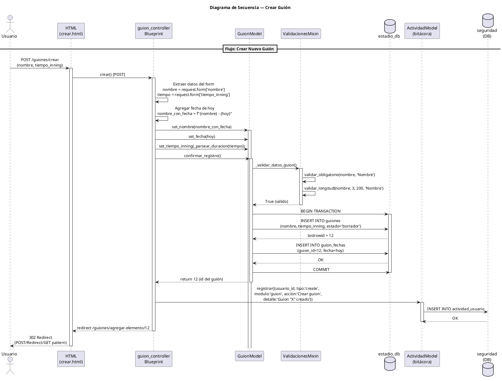

### 12.3 Diagrama de Secuencia — Iniciar Guión en Vivo

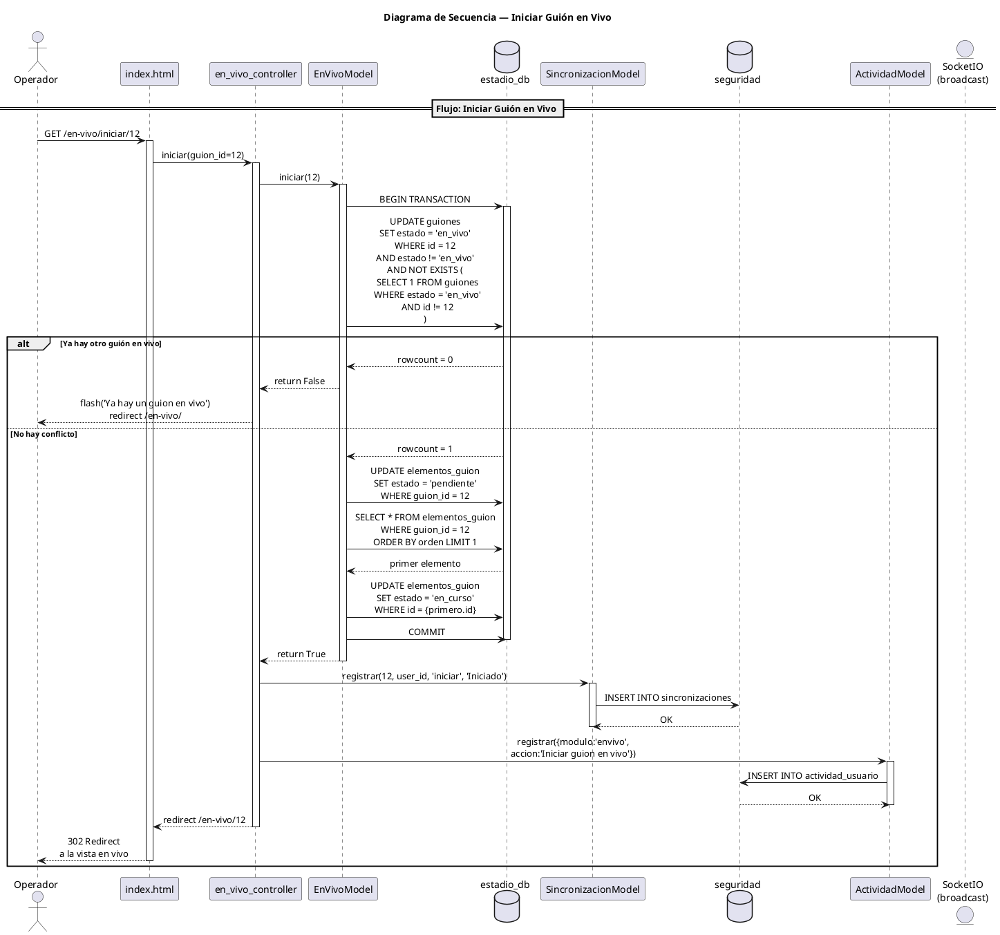

### 12.4 Diagrama de Secuencia — Sincronizar Estado (Tiempo Real)

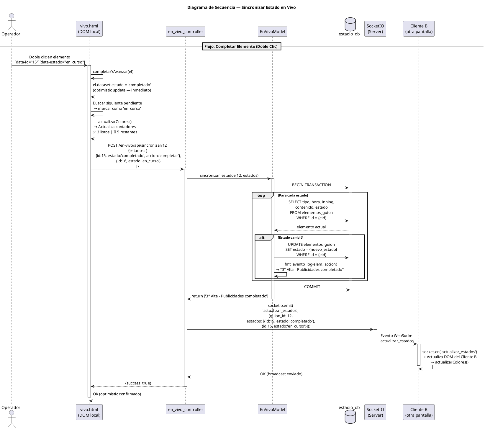

### 12.5 Diagrama de Secuencia — Flujo de Permisos

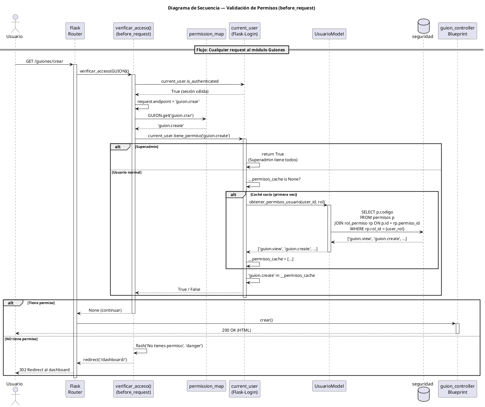

### 12.6 Diagrama de Máquina de Estados — Guión

```plantuml
@startuml
skinparam state {
    BackgroundColor<<initial>> LightBlue
    BackgroundColor<<final>> LightRed
    BackgroundColor>> PaleGreen
}

title Máquina de Estados — Ciclo de Vida de un Guión

[*] --> borrador : Crear guión\n(guion_model.registrar())

borrador --> publicado : Publicar\n(guion_model.modificar\n(estado='publicado'))
borrador --> [*] : Eliminar\n(soft delete:\nstatus=0)

publicado --> en_vivo : Iniciar\n(en_vivo_model.iniciar())\n[Solo 1 en vivo a la vez]
publicado --> borrador : Editar\nguion_model.modificar()

en_vivo --> finalizado : Finalizar\n(en_vivo_model.finalizar())\nelementos → pendiente

finalizado --> en_vivo : Reiniciar\n(en_vivo_model.iniciar())\nelementos → en_curso

note right of en_vivo
    **Restricción SQL:**
    UPDATE ... WHERE NOT EXISTS (
      SELECT 1 FROM guiones
      WHERE estado = 'en_vivo'
    )
    Solo UN guión puede estar en vivo.
end note

note bottom of finalizado
    **Efecto al finalizar:**
    - guion.estado = 'finalizado'
    - Todos los elementos → 'pendiente'
end note

@enduml
```

### 12.7 Diagrama de Máquina de Estados — Elemento del Guión

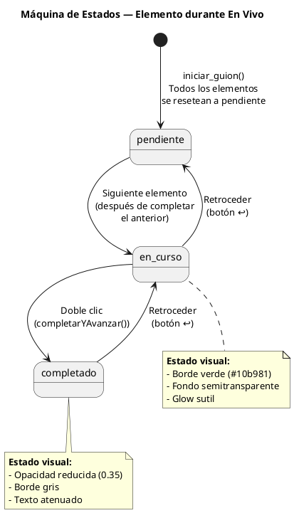

### 12.8 Diagrama de Componentes (UML Component Diagram)

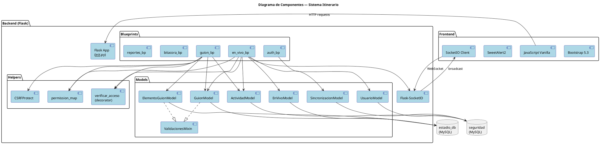

### 12.9 Diagrama ER (Entidad-Relación) Completo

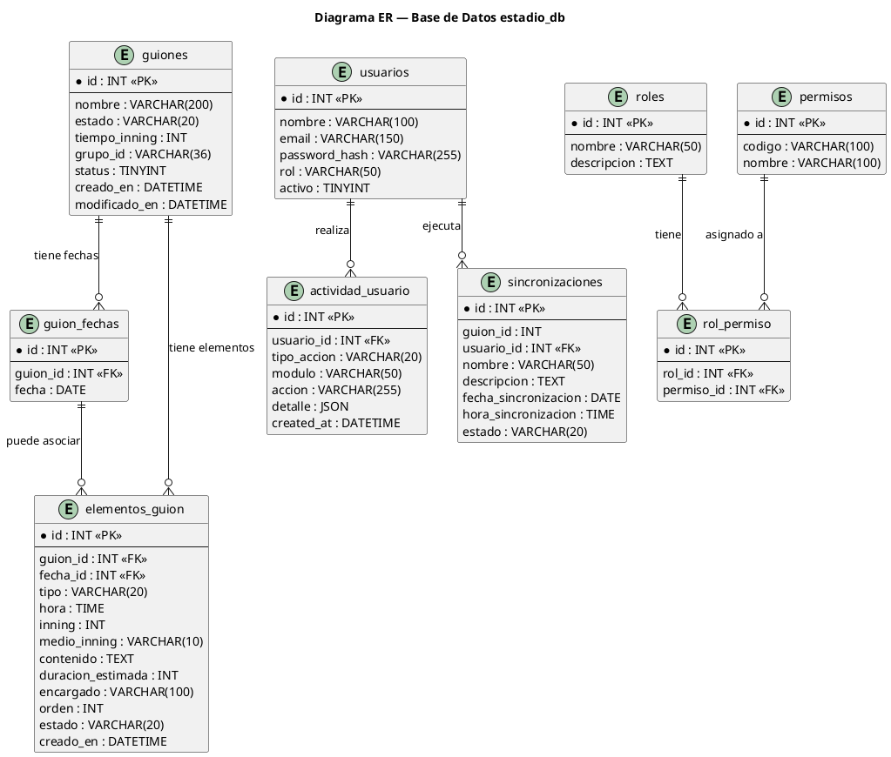

### 12.10 Diagrama de Despliegue (Deployment Diagram)

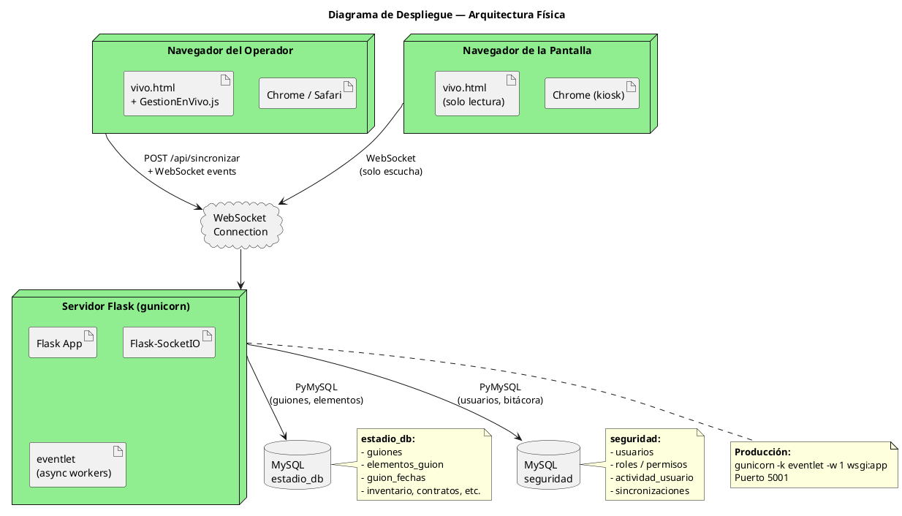

### 12.11 Diagrama de Secuencia — Agregar Elemento al Guión

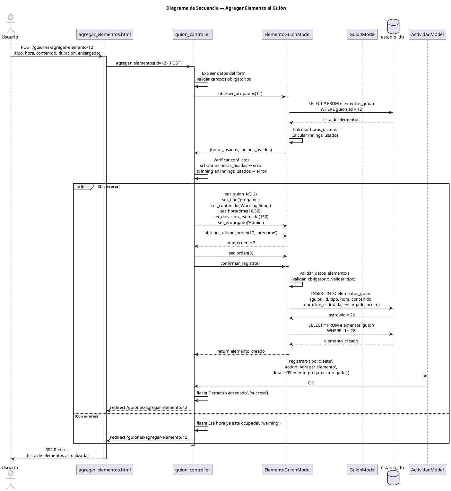

### 12.12 Diagrama de Secuencia — Replicar Guión

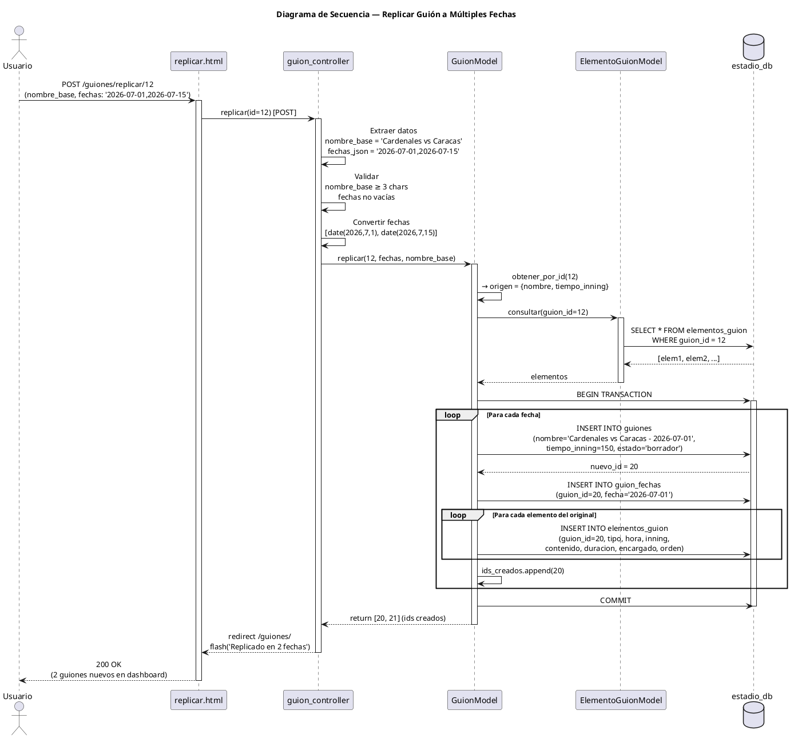

---

## 13. Validación de Permisos — Flujo Completo

### Cadena de autenticación y autorización

```
┌─────────────────────────────────────────────────────────────────┐
│                    FLUJO DE UNA REQUEST                         │
│                                                                 │
│  1. Request llega al servidor                                   │
│     │                                                           │
│  2. Flask-Login verifica cookie de sesión                       │
│     │                                                           │
│     ├─ No autenticado → redirect /login                         │
│     │                                                           │
│     ├─ Autenticado → carga current_user                         │
│     │                                                           │
│  3. before_request: verificar_sesion_unica()                    │
│     │                                                           │
│     ├─ Sesión cerrada desde otro dispositivo                    │
│     │  → logout + redirect /login                               │
│     │                                                           │
│     ├─ Sesión válida → continúa                                 │
│     │                                                           │
│  4. before_request: verificar_acceso(MODULE_MAP)                │
│     │                                                           │
│     ├─ Busca endpoint en MODULE_MAP                             │
│     │                                                           │
│     ├─ Endpoint no está en el mapa → permitir                   │
│     │  (rutas no mapeadas no tienen restricción)                │
│     │                                                           │
│     ├─ Endpoint tiene permiso requerido                         │
│     │                                                           │
│     │  5. current_user.tiene_permiso(codigo)                    │
│     │     │                                                     │
│     │     ├─ Superadmin → return True (todos los permisos)      │
│     │     │                                                     │
│     │     ├─ Verificar __permisos_cache                         │
│     │     │                                                     │
│     │     │  6. Caché vacío?                                    │
│     │     │     │                                               │
│     │     │     ├─ Sí → Query a DB:                             │
│     │     │     │   SELECT p.codigo                             │
│     │     │     │   FROM permisos p                             │
│     │     │     │   JOIN rol_permiso rp ON p.id = rp.permiso_id│
│     │     │     │   WHERE rp.rol_id = {user.rol}                │
│     │     │     │                                               │
│     │     │     │   Guardar en __permisos_cache                 │
│     │     │     │                                               │
│     │     │     └─ No → usar caché existente                    │
│     │     │                                                     │
│     │     └─ Return: codigo in __permisos_cache                 │
│     │                                                           │
│     ├─ Tiene permiso → permitir (None = continuar)              │
│     │                                                           │
│     └─ NO tiene permiso                                         │
│        │                                                        │
│        ├─ POST → jsonify({'error': 'Sin permiso'}), 403        │
│        └─ GET → flash('Sin permiso') + redirect /dashboard     │
│                                                                 │
│  6. Controller ejecuta la función de la ruta                    │
│                                                                 │
│  7. Response al cliente                                         │
└─────────────────────────────────────────────────────────────────┘
```

### Tabla de permisos del módulo Guiones

| Endpoint | Permiso requerido | Acción |
|----------|-------------------|--------|
| `guion.dashboard` | `guion.view` | Ver listado |
| `guion.crear` | `guion.create` | Crear guión |
| `guion.agregar_elementos` | `guion.edit` | Agregar/editar elementos |
| `guion.editar_elemento` | `guion.edit` | Editar un elemento |
| `guion.eliminar_elemento` | `guion.edit` | Eliminar un elemento |
| `guion.editar` | `guion.edit` | Editar datos del guión |
| `guion.previsualizar` | `guion.preview` | Ver preview |
| `guion.publicar` | `guion.publish` | Cambiar a publicado |
| `guion.eliminar` | `guion.delete` | Soft delete |
| `guion.replicar` | `guion.create` | Duplicar guión |
| `guion.verificar_nombre` | `guion.view` | AJAX duplicate check |

### Tabla de permisos del módulo En Vivo

| Endpoint | Permiso requerido | Acción |
|----------|-------------------|--------|
| `en_vivo.index` | `envivo.view` | Ver guiones disponibles |
| `en_vivo.ver` | `envivo.view` | Ver pantalla en vivo |
| `en_vivo.iniciar` | `envivo.control` | Iniciar guión |
| `en_vivo.finalizar` | `envivo.control` | Finalizar guión |
| `en_vivo.sincronizar` | `envivo.control` | Cambiar estados (API) |
| `en_vivo.ver_log` | `envivo.view` | Ver log de sincronizaciones |
| `en_vivo.estado_actual` | `envivo.view` | API de estados |
| `en_vivo.guiones_por_fecha` | `envivo.view` | API de guiones por fecha |

### Por qué permisos separados por acción

```
guion.view    → Solo ver (lectura)
guion.create  → Crear guiones
guion.edit    → Modificar elementos
guion.publish → Cambiar estado a publicado
guion.delete  → Eliminar guiones
```

**Escenario real:** Un asistente puede ver guiones (`guion.view`) pero no puede eliminarlos (`guion.delete`). Un productor puede todo excepto eliminar. Un operador de en vivo solo ve (`envivo.view`) pero no inicia/finaliza (`envivo.control`).

---

## 14. Diagramas UML — Resumen Ejecutivo

### Tabla resumen de diagramas

| # | Diagrama | Qué muestra | Cuándo usarlo en la defensa |
|---|----------|-------------|---------------------------|
| 12.1 | **Clases** | Estructura de clases, herencia, composición | "Explícame la arquitectura de capas" |
| 12.2 | **Secuencia: Crear** | Flujo completo crear guión | "Cómo se crea un guión paso a paso" |
| 12.3 | **Secuencia: Iniciar** | Flujo iniciar en vivo | "Qué pasa al iniciar un partido" |
| 12.4 | **Secuencia: Sincronizar** | Flujo tiempo real | "Cómo funciona la sincronización" |
| 12.5 | **Secuencia: Permisos** | Cadena de autoricación | "Cómo se validan los permisos" |
| 12.6 | **Estados: Guión** | Machine de estados del guión | "Cuáles son los estados de un guión" |
| 12.7 | **Estados: Elemento** | Estados durante en vivo | "Cómo cambia un elemento en vivo" |
| 12.8 | **Componentes** | Capas del sistema | "Cómo se organiza el sistema" |
| 12.9 | **ER** | Modelo de base de datos | "Cómo se estructuran los datos" |
| 12.10 | **Despliegue** | Arquitectura física | "Cómo se despliega" |
| 12.11 | **Secuencia: Agregar** | Agregar elemento | "Cómo se agrega contenido a un guión" |
| 12.12 | **Secuencia: Replicar** | Duplicar guión | "Cómo se reutilizan guiones" |

---

## 15. Glosario de Términos para la Defensa

| Término | Definición simple |
|---------|-------------------|
| **MVC** | Patrón que separa Modelo (datos), Vista (UI), Controlador (lógica) |
| **Blueprint** | Módulo de Flask que agrupa rutas relacionadas |
| **WebSocket** | Protocolo de comunicación bidireccional en tiempo real |
| **SocketIO** | Librería que implementa WebSocket con fallback automático |
| **Optimistic Update** | Cambiar la UI antes de confirmar con el servidor |
| **PRG** | Post/Redirect/Get — patrón para evitar reenvío de formularios |
| **Soft Delete** | Marcar como eliminado sin borrar físicamente |
| **CSRF** | Ataque donde un sitio externo usa tu sesión para enviar formularios |
| **Mixin** | Clase que se "mezcla" en otra para reutilizar código |
| **Before Request** | Función que se ejecuta antes de cada request en un Blueprint |
| **Transaction** | Grupo de queries que se ejecutan juntas o ninguna |
| **State Machine** | Sistema donde un objeto cambia entre estados definidos |
| **Validation in Depth** | Múltiples capas de validación para seguridad |
| **Bitácora** | Registro de auditoría de acciones del sistema |
| **Grupo ID** | UUID que agrupa guiones replicados del mismo original |
